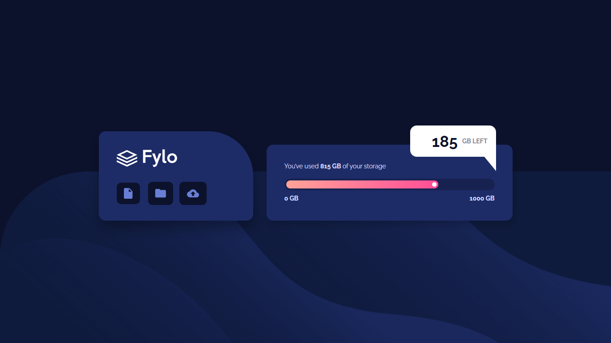
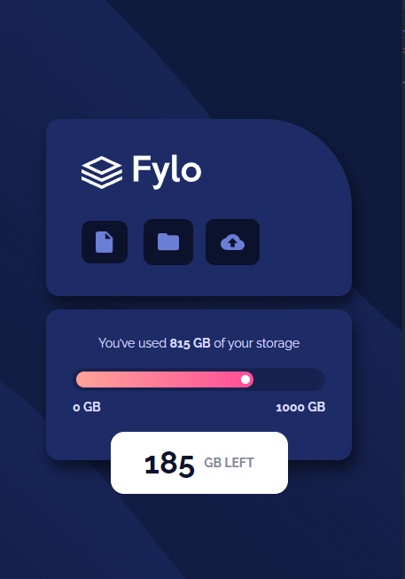

# Frontend Mentor - Fylo data storage component solution

### Screenshot

### Links

- Solution URL: [Add solution URL here](https://github.com/Wellissonb/fylo-data-storage-component)
- Live Site URL: [Add live site URL here](https://wellissonb.github.io/fylo-data-storage-component/)

## My process

### Built with

- Grid
- Semantic HTML5 markup
- CSS custom properties
- Flexbox
- Mobile-first workflow

### What I learned

I learned to work with range input styles and to make geometric shapes using css
